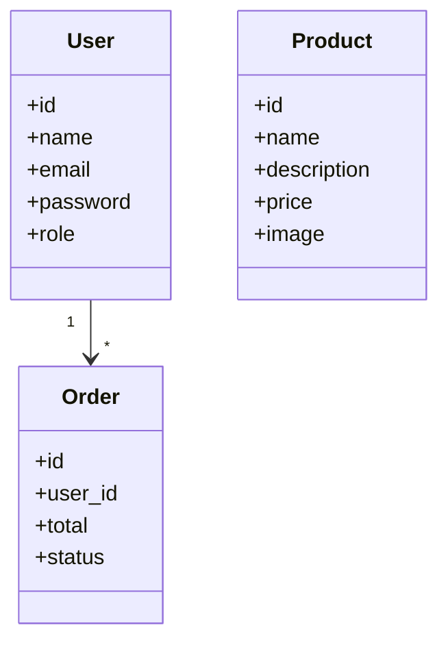
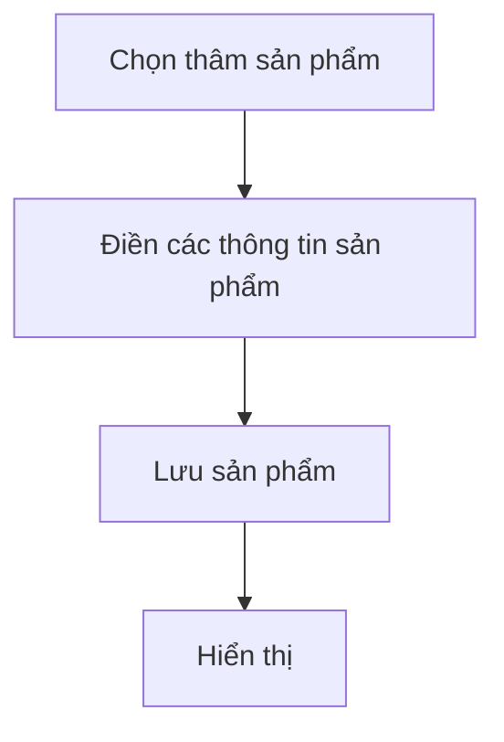
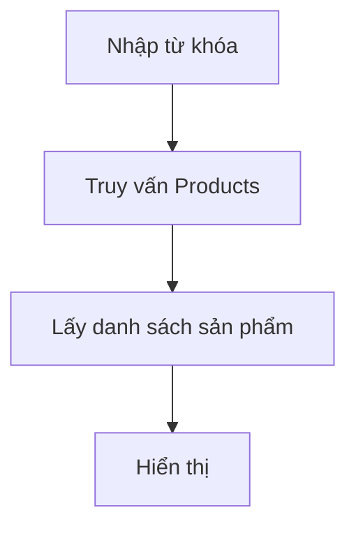

# 🛍️ Laravel Mini Shop

**Họ tên sinh viên:** Nguyễn Minh Ánh
**Mã sinh viên:** 23010718

---

## 🚀 Giới thiệu

**Laravel Mini Shop** là ứng dụng web quản lý bán hàng xây dựng bằng Laravel, hỗ trợ đăng nhập/đăng ký, quản lý sản phẩm, danh sách yêu thích và khôi phục mật khẩu.

### 🎯 Chức năng chính
- **Sản phẩm**: CRUD (Tạo, Đọc, Cập nhật, Xóa)
- **Người dùng**: Đăng ký, đăng nhập (Laravel Breeze)
- **Yêu thích**: Thêm/xóa sản phẩm yêu thích
- **Đơn hàng**: Tạo, xem, quản lý đơn hàng
- **Tìm kiếm**: Tìm sản phẩm theo tên
- **Bảo mật**: CSRF, XSS, Validation, SQL Injection, Session/Cookie

---

## 📦 Class Diagram



---

## 🔁 Activity Diagram

### 1. Tạo sản phẩm


### 2. Tìm kiếm sản phẩm 


---

## 🖼️ Các chức năng chính của dự án

- **Trang chủ**: 

- **Đăng nhập**: 

- **Quản lý sản phẩm**: 


---

## 🧩 Code mẫu

### Model: `Product.php`
```php
<?php

namespace App\Models;

use Illuminate\Database\Eloquent\Model;

class Product extends Model
{
    protected $fillable = ['name', 'description', 'price', 'image'];
}

```

### Controller: `ProductController.php`
```php
<?php
namespace App\Http\Controllers;

use App\Models\Product;
use Illuminate\Http\Request;
use Illuminate\Support\Facades\Storage;
class ProductController extends Controller
{
    public function index()
    {
        $products = Product::all();
        return view('products.index', compact('products'));
    }
    public function create()
    {
        return view('products.create');
    }
    public function store(Request $request)
    {
        $request->validate([
            'name' => 'required|string|max:255',
            'description' => 'nullable|string',
            'price' => 'required|numeric',
            'image' => 'nullable|image|max:2048',
        ]);

        $data = $request->all();

        if ($request->hasFile('image')) {
            $file = $request->file('image');
            $path = $file->store('images', 'public');
            $data['image'] = $path;
        }

        Product::create($data); 

        return redirect()->route('products.index')->with('success', 'Product created successfully.');
    }

    public function show(Product $product)
    {
        //
    }

    public function edit(Product $product)
    {
        return view('products.edit', compact('product'));
    }

    public function update(Request $request, Product $product)
    {
        $request->validate([
            'name' => 'required|string|max:255',
            'description' => 'nullable|string',
            'price' => 'required|numeric',
        ]);

        $data = $request->all();

        if ($request->hasFile('image')) {
            $file = $request->file('image');
            $path = $file->store('images', 'public');
            $data['image'] = $path;
        }

        $product->update($data); 
        return redirect()->route('products.index')->with('success', 'Product updated successfully.');
    }

    public function destroy(Product $product)
    {
        $product->delete();

        return redirect()->route('products.index')->with('success', 'Product deleted successfully.');
    }
    public function search(Request $request)
    {
        $keyword = $request->input('q');
        $products = Product::where('name', 'like', "%$keyword%")->get();
        return view('products.search', compact('products', 'keyword'));
    }
        public function home()
    {
        $products = Product::latest()->take(10)->get(); 
        return view('home', compact('products'));
    }

}

```

### View: `products/index.blade.php`
```blade
@extends('layouts.app')

@section('content')
<div class="max-w-7xl mx-auto px-4 py-6 bg-white rounded shadow">
    <h2 class="text-xl font-semibold mb-4">Sản phẩm yêu thích</h2>
    <p>Chức năng đang được phát triển ✨</p>
</div>
<div x-data="productModal()" class="max-w-7xl mx-auto mt-10 px-4 bg-gradient-to-b from-pink-200 via-pink-100 to-white rounded-lg shadow-lg p-6">

    <div class="bg-white bg-opacity-80 shadow-lg rounded-lg p-6">
        <div class="flex justify-between items-center mb-4">
            <h1 class="text-2xl font-bold text-pink-600">🛍️ Mini Shop</h1>
        </div>

        <!-- Tabs -->
        <div class="mb-6 border-b border-pink-300">
            <ul class="flex flex-wrap -mb-px text-sm font-medium text-center" id="productTabs" role="tablist">
                <li class="mr-2">
                    <a href="#" class="inline-block p-4 border-b-2 rounded-t-lg text-pink-600 border-pink-600 active" onclick="openTab(event, 'list')">📦 Danh sách</a>
                </li>
                <li class="mr-2">
                    <a href="#" class="inline-block p-4 border-b-2 rounded-t-lg text-gray-500 hover:text-pink-600 hover:border-pink-600" onclick="openTab(event, 'create')">➕ Thêm sản phẩm</a>
                </li>
            </ul>
        </div>

        <!-- Danh sách sản phẩm -->
        <div id="list" class="tab-content">
            @if(session('success'))
                <div class="bg-green-100 text-green-800 px-4 py-2 rounded mb-4">
                    {{ session('success') }}
                </div>
            @endif

            <div class="overflow-x-auto rounded-lg border border-pink-300 shadow-sm">
                <table class="min-w-full text-sm text-left text-gray-700">
                    <thead class="bg-pink-50">
                        <tr>
                            <th class="px-4 py-2">STT</th>
                            <th class="px-4 py-2">Tên</th>
                            <th class="px-4 py-2">Mô tả</th>
                            <th class="px-4 py-2">Giá</th>
                            <th class="px-4 py-2">Ảnh</th>
                            <th class="px-4 py-2">Hành động</th>
                        </tr>
                    </thead>
                    <tbody>
                        @foreach($products as $product)
                        <tr class="border-b border-pink-200 hover:bg-pink-50">
                            <td class="px-4 py-2">{{ $loop->iteration }}</td>
                            <td class="px-4 py-2">{{ $product->name }}</td>
                            <td class="px-4 py-2">{{ $product->description }}</td>
                            <td class="px-4 py-2">{{ number_format($product->price) }} đ</td>
                            <td class="px-4 py-2">
                                @if($product->image)
                                    image) }}" alt="Product Image" class="w-16 h-16 object-cover rounded">
                                @else
                                    <span class="text-gray-400 italic">No image</span>
                                @endif
                            </td>
                            <td class="px-4 py-2 space-x-2">
                                <button 
                                    @click="openEdit({{ $product->id }}, '{{ addslashes($product->name) }}', '{{ addslashes($product->description) }}', {{ $product->price }})" 
                                    class="text-pink-600 hover:underline cursor-pointer font-semibold">
                                    Sửa
                                </button>
                                <form action="{{ route('products.destroy', $product) }}" method="POST" class="inline">
                                    @csrf @method('DELETE')
                                    <button class="text-red-500 hover:underline font-semibold" onclick="return confirm('Xoá thật à?')">Xoá</button>
                                </form>
                            </td>
                        </tr>
                        @endforeach
                    </tbody>
                </table>
            </div>
        </div>

        <!-- Form thêm sản phẩm -->
        <div id="create" class="tab-content hidden">
            <form action="{{ route('products.store') }}" method="POST" enctype="multipart/form-data" class="space-y-4">
                @csrf
                <div>
                    <label for="image" class="block text-pink-600 font-semibold mb-1">Ảnh sản phẩm</label>
                    <input type="file" name="image" id="image"
                        class="mt-1 block w-full rounded-md border-pink-300 shadow-sm">
                </div>

                <div>
                    <label class="block font-semibold text-pink-700 mb-1">Tên sản phẩm</label>
                    <input type="text" name="name" required class="w-full p-2 border border-pink-300 rounded focus:ring-pink-400 focus:border-pink-400">
                </div>
                <div>
                    <label class="block font-semibold text-pink-700 mb-1">Mô tả</label>
                    <textarea name="description" class="w-full p-2 border border-pink-300 rounded focus:ring-pink-400 focus:border-pink-400"></textarea>
                </div>
                <div>
                    <label class="block font-semibold text-pink-700 mb-1">Giá</label>
                    <input type="number" name="price" step="0.01" required class="w-full p-2 border border-pink-300 rounded focus:ring-pink-400 focus:border-pink-400">
                </div>
                <button type="submit" class="bg-pink-600 text-white px-4 py-2 rounded hover:bg-pink-700 transition">💾 Lưu sản phẩm</button>
            </form>
        </div>
    </div>

    <!-- Modal popup sửa sản phẩm -->
    <div 
        x-show="isOpen" 
        x-transition
        class="fixed inset-0 bg-gradient-to-b from-pink-400 via-pink-300 to-pink-200 bg-opacity-90 flex items-center justify-center z-50"
        style="display: none;"
    >
        <div class="bg-white rounded-lg shadow-lg w-full max-w-md p-6 overflow-y-auto max-h-[80vh]" @click.away="close()">
            <h2 class="text-xl font-bold mb-4 text-pink-600">✏️ Sửa sản phẩm</h2>
            <form :action="`/products/${productId}`" method="POST" enctype="multipart/form-data" class="space-y-4">
                @csrf
                @method('PUT')

                <div>
                    <label for="edit-name" class="block font-semibold mb-1 text-pink-700">Tên sản phẩm</label>
                    <input id="edit-name" name="name" type="text" x-model="name" required
                        class="w-full border border-pink-300 rounded px-3 py-2 focus:ring-pink-400 focus:border-pink-400" />
                </div>
                <div>
                    <label for="edit-description" class="block font-semibold mb-1 text-pink-700">Mô tả</label>
                    <textarea id="edit-description" name="description" x-model="description"
                        class="w-full border border-pink-300 rounded px-3 py-2 focus:ring-pink-400 focus:border-pink-400"></textarea>
                </div>
                <div>
                    <label for="edit-price" class="block font-semibold mb-1 text-pink-700">Giá (VNĐ)</label>
                    <input id="edit-price" name="price" type="number" step="0.01" x-model="price" required
                        class="w-full border border-pink-300 rounded px-3 py-2 focus:ring-pink-400 focus:border-pink-400" />
                </div>
                <div>
                    <label for="edit-image" class="block font-semibold mb-1 text-pink-700">Ảnh sản phẩm (cập nhật)</label>
                    <input id="edit-image" name="image" type="file" class="w-full" />
                </div>

                <div class="flex justify-end space-x-2 mt-4">
                    <button type="button" @click="close()" class="px-4 py-2 border rounded hover:bg-gray-100">Huỷ</button>
                    <button type="submit" class="bg-pink-600 text-white px-4 py-2 rounded hover:bg-pink-700">Cập nhật</button>
                </div>
            </form>
        </div>
    </div>

</div>

<script src="//unpkg.com/alpinejs" defer></script>
<script>
function openTab(evt, tabId) {
    const tabs = document.querySelectorAll('.tab-content');
    tabs.forEach(tab => tab.classList.add('hidden'));

    const links = document.querySelectorAll('#productTabs a');
    links.forEach(link => link.classList.remove('text-pink-600', 'border-pink-600', 'active'));

    document.getElementById(tabId).classList.remove('hidden');
    evt.currentTarget.classList.add('text-pink-600', 'border-pink-600', 'active');
}

function productModal() {
    return {
        isOpen: false,
        productId: null,
        name: '',
        description: '',
        price: '',

        openEdit(id, name, description, price) {
            this.productId = id;
            this.name = name;
            this.description = description;
            this.price = price;
            this.isOpen = true;
        },

        close() {
            this.isOpen = false;
            this.productId = null;
            this.name = '';
            this.description = '';
            this.price = '';
        }
    }
}
</script>
@endsection

```

---

## 🧠 Bảo mật

| Tính năng        | Trạng thái                        |
|------------------|-----------------------------------|
| CSRF             | ✅ (`@csrf` trong form)            |
| XSS              | ✅ (Escape output bằng `{{ }}`)    |
| Validation       | ✅ (`$request->validate()`)        |
| Authentication   | ✅ (Laravel Breeze)                |
| Authorization    | ✅ (Middleware `auth`)             |
| SQL Injection    | ✅ (Eloquent ORM)                  |
| Session/Cookie   | ✅ (Laravel mặc định)              |

---

## ☁️ Triển khai Cloud
- **Database**: Laravel
- **Cấu hình**: Eloquent migration, file `.env`
- **Deploy**: Railway

---

## 🔗 Liên kết
- **GitHub Repo**: https://github.com/NmA3108/Mini_Shop.git
- **Demo**: 
- **Link deployment(public) web**: https://minishop-production-964b.up.railway.app

---

## 👨‍🎓 Người thực hiện
**Họ tên:** Nguyễn Minh Ánh  
**Mã sinh viên:** 23010718
**Môn học:** Thiết kế Web nâng cao – Giữa kỳ
```

---
